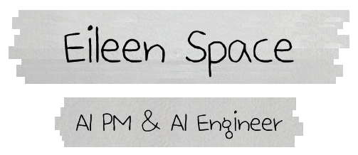

 

<small><b>Chemistry M.S. | 제약/바이오/화장품 IP 11년+ | AI 전환 개발자</b></small> 
<small>도메인 지식과 AI 기술을 결합한 서비스를 만듭니다.</small>

---

<h3 align="center">🌟 About Me 🌟</h3>

 

<small>📍 <b>Location</b>: Seoul, South Korea 🇰🇷</small> 
<small>🎓 <b>Background</b>: Chemistry M.S. → Pharma/Cosmetics IP 11yr → AI PM & AI Engineer</small> 
<small>🔉 <b>Current Focus</b>: RAG Systems & sLLM Fine-tuning · Patent Analysis Automation (FTO) · AI-Powered Domain Solutions</small> 
<small>🎉 <b>Philosophy</b>: "Bridge the gap between Business and Technology"</small> 
<small>❓ <b>Ask Me About</b>: RAG | LangGraph | sLLM | FTO | Patent Analysis | Django | FastAPI | Career Transition</small>

---

<h3 align="center">🌟 Core Strengths 🌟</h3>

 

<small><b>Biz-Tech Bridge</b> — 제약/화장품 IP 11년 실무 경험을 바탕으로, 현업의 Pain Point를 AI 솔루션으로 연결합니다.</small> 
<small><b>AI Native Capability</b> — sLLM 파인튜닝, RAG 파이프라인, 하이브리드 검색까지 직접 설계하고 구현합니다.</small> 
<small><b>Problem Solving</b> — FTO 분석 자동화 시스템을 직접 구축하여 정확도 95%, 속도 37.5% 개선을 달성했습니다.</small> 
<small><b>Data-Driven</b> — 8만+ 특허 데이터 처리, 임베딩·청크 전략 최적화 실험 등 데이터 기반으로 문제를 해결합니다.</small> 
<small><b>AI Tool Leverage</b> — Claude cli, Gemini cli, Replit 등 AI 코딩 도구를 활용한 바이브코딩으로 빠르게 프로토타입을 구현합니다.</small>

---

<h3 align="center">🌟 Tech Stack 🌟</h3>

<small><b>Languages / Frameworks</b></small> 

<small><b>AI / ML</b></small> 

<small><b>Database / Infra</b></small> 

---

<h3 align="center">🌟 Featured Projects 🌟</h3>

 

🔬 **[FTOGuard](https://github.com/SKNETWORKS-FAMILY-AICAMP/SKN20-FINAL-2TEAM)** `🏆 Awards: SK네트웍스 Family AI캠프 20기 최우수상` 
<small>sLLM 기반 특허 침해(FTO) 분석 자동화 서비스</small> 
<small>8만+ 특허 데이터 수집 · 하이브리드 검색(Dense+BM25) · RRF 랭킹 · Qwen 2.5 파인튜닝 · Gemini 학습 데이터 생성 · 자동 품질 검증 시스템 구축</small> 
<small><code>Qwen 2.5</code> <code>LangGraph</code> <code>FastAPI</code> <code>Django</code> <code>ChromaDB</code> <code>RunPod</code></small>  

📚 **[PaperSnack v2](https://github.com/SKNETWORKS-FAMILY-AICAMP/SKN20-4th-2TEAM)** 
<small>HuggingFace Weekly Papers RAG 챗봇 고도화</small> 
<small>RAGAS 평가 체계 도입 · Django 회원/채팅 히스토리 · Docker 멀티컨테이너 배포 · Nginx 리버스 프록시</small> 
<small><code>Django</code> <code>FastAPI</code> <code>LangGraph</code> <code>ChromaDB</code> <code>Docker</code> <code>Nginx</code> <code>RAGAS</code></small>  

🔍 **[PaperSnack v1](https://github.com/SKNETWORKS-FAMILY-AICAMP/SKN20-3rd-2TEAM)** 
<small>HuggingFace Weekly Papers 트렌드 검색 RAG 챗봇</small> 
<small>논문 크롤링 · 임베딩 모델 7종 × 청크 전략 6종 비교 실험 · K-Means 트렌드 클러스터링 · LangGraph RAG 라우팅</small> 
<small><code>LangChain</code> <code>LangGraph</code> <code>FastAPI</code> <code>ChromaDB</code> <code>K-Means</code></small>  

📊 **[Netflix 고객 이탈률 예측](https://github.com/SKNETWORKS-FAMILY-AICAMP/SKN20-2nd-5TEAM)** 
<small>ML/DL 모델 기반 고객 이탈 예측 + 맞춤 구독 추천</small> 
<small>ML 9종 비교 · 앙상블(Bagging, AdaBoost, Voting) · GridSearchCV 교차 검증 · Streamlit 추천 UI</small> 
<small><code>PyTorch</code> <code>scikit-learn</code> <code>Streamlit</code> <code>Pandas</code></small>  

🚗 **[차량 정보 조회 시스템](https://github.com/SKNETWORKS-FAMILY-AICAMP/SKN20-1ST-4TEAM)** 
<small>2015~2024 연료별 차량 현황 대시보드 + 기아 FAQ</small> 
<small>기아 FAQ 크롤링 · MySQL DB 연동 · 연료/차종/연도별 필터링 · Plotly 시각화</small> 
<small><code>Streamlit</code> <code>Plotly</code> <code>MySQL</code> <code>Selenium</code> <code>BeautifulSoup</code></small>

---

<h3 align="center">🌟 GitHub Stats 🌟</h3>

  

---

<h3 align="center">🌟 Contact 🌟</h3>

